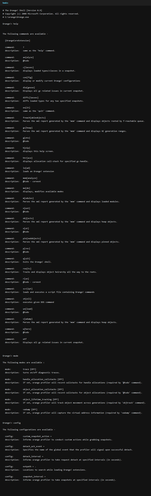
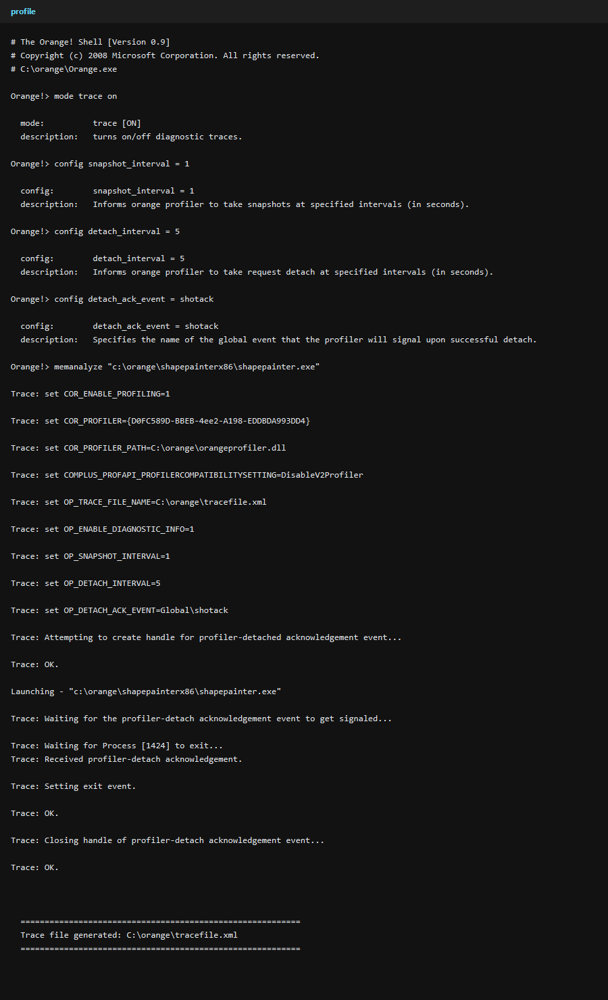
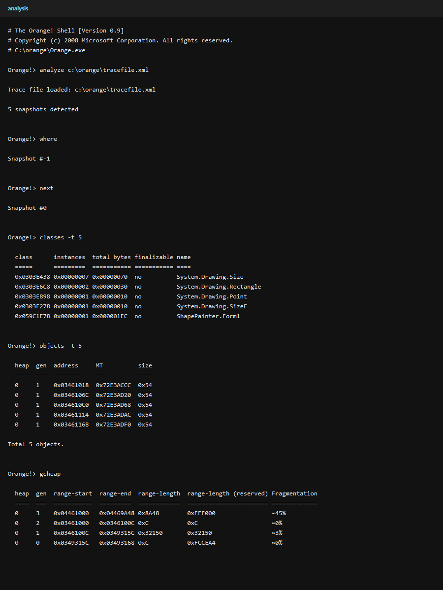
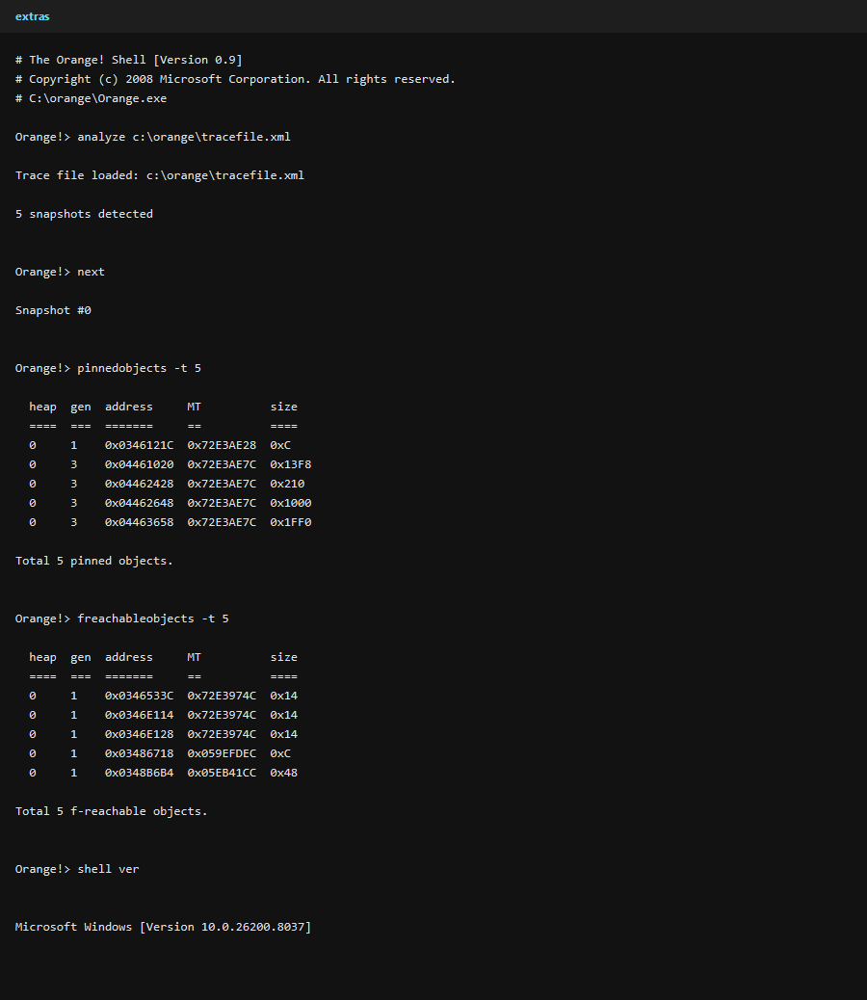

# 🍊 Orange Profiler

> ⚠️ **Legacy codebase ahead:** this project appears to have been created around **2008-2009** — roughly **18 years ago**. It has real historical value, but it is **not guaranteed to work** on modern machines without extra setup or fixes.

> 🛠️ The long-term intent is to **modernize and update this codebase for the current .NET runtime** and a more current Windows development toolchain.

## 📖 What is this?

`orange-profiler` is a Windows-focused memory profiling and trace-analysis toolchain built around:

- `Orange.exe` — a small command shell / CLI
- `OrangeCoreExtension.dll` — the built-in command set
- `OrangeProfiler.dll` — the native profiler component
- supporting managed/native helper libraries and UI utilities

From the code and solution layout, this repository was used as a **CLR profiler test and diagnostics environment** for launching or attaching to processes, collecting memory traces, and navigating those traces afterward.

## 🧭 Repository layout

| Path | Purpose |
| --- | --- |
| `Orange\` | Main CLI shell (`Orange.exe`) |
| `OrangeCoreExtension\` | Built-in commands such as `help`, `config`, `mode`, `load`, `run`, `script`, and `memanalyze` |
| `OrangeProfiler\` | Native Win32 profiler DLL |
| `NativeWrappers\` | Managed wrappers around native/Win32 pieces |
| `OrangeUtil\` | Shared utilities |
| `ShapePainter\` | Additional executable/tooling |
| `AuxiliaryPanel\` | Older WinForms helper UI |

## ⚙️ Prerequisites

This repository is very Windows-specific. The safest assumptions are:

- **Windows**
- **x86 build target**
- **.NET Framework 4.8 targeting support**
- a recent **.NET SDK** (the managed projects build with `dotnet build` in this environment)
- likely **Visual Studio / Build Tools with C++ support** for the native profiler project

## 🏗️ Building

### Recommended build

The most practical build configuration today is:

```powershell
dotnet build .\Orange.sln -c Debug -p:Platform=x86
```

### Why `Debug|x86`?

In this codebase, the `Debug|x86` configuration is special:

- `Orange`
- `OrangeCoreExtension`
- `OrangeUtil`
- `NativeWrappers`
- `OrangeProfiler`

all target a shared output location under:

```text
C:\orange
```

That matters because `Orange.exe` expects `OrangeCoreExtension.dll` to be available **next to it** at runtime.

### What was verified

The following worked in this environment:

```powershell
dotnet build .\Orange.sln -c Debug -p:Platform=x86
```

and produced artifacts including:

- `C:\orange\Orange.exe`
- `C:\orange\OrangeCoreExtension.dll`
- `C:\orange\OrangeUtil.dll`
- `C:\orange\NativeWrappers.dll`
- `C:\orange\OrangeProfiler.dll`

> ℹ️ `Release` is less convenient here: several projects output to local `bin\Release\` folders instead of the shared `C:\orange` directory.

## ▶️ Running the CLI

The CLI lives in the `Orange\` project, but the easiest way to run it is from the shared debug output folder.

### Interactive shell

```powershell
Set-Location C:\orange
.\Orange.exe
```

That launches the Orange shell and shows a prompt like:

```text
Orange!>
```

Inside the interactive shell, enter commands such as:

```text
help
help config
config
mode
quit
```

### One-shot command mode

`Orange.exe` also accepts startup commands from the command line.

```powershell
Set-Location C:\orange
.\Orange.exe '!help'
.\Orange.exe '!help config'
```

Important details from the implementation:

- startup commands must include the **`!` prefix**
- after running the initial command(s), the shell **exits**
- normal completion currently returns exit code **`100`**

You can also pass multiple startup commands, for example:

```powershell
.\Orange.exe '!help' '!mode trace on'
```

## 🧪 Verified profiler workflow

I was able to get the profiler to load and emit a real trace in this environment.

### What worked

For an **x86 managed target**, this command pattern worked:

```powershell
Set-Location C:\orange
.\Orange.exe `
  '!mode trace on' `
  '!config snapshot_interval = 1' `
  '!config detach_interval = 5' `
  '!config detach_ack_event = sampleack' `
  '!memanalyze "C:\orange\Orange.exe"'
```

Observed behavior:

- `memanalyze` launches the target under the profiler
- `snapshot_interval` and `detach_interval` are interpreted in **seconds**
- `detach_ack_event` lets Orange wait for profiler detach instead of process exit
- the profiler writes its output to:

```text
C:\orange\tracefile.xml
```

I also verified the same flow against a **32-bit forced copy** of `ShapePainter.exe`.

### Important x86 caveat

`Orange.exe` and `OrangeProfiler.dll` are x86-oriented.

The repository’s default `ShapePainter.exe` build is effectively **AnyCPU**:

- `PE32`
- `ILONLY`
- `32BITREQ = 0`
- `32BITPREF = 0`

On a 64-bit machine, that means it may run as a 64-bit process, and the x86 profiler will not load into it.

To use `ShapePainter` as a profiling target in this environment, I had to:

```powershell
dotnet build .\ShapePainter\ShapePainter.csproj -c Debug -p:PlatformTarget=x86 -p:OutputPath='C:\orange\ShapePainterX86\'
& 'C:\Program Files (x86)\Microsoft SDKs\Windows\v10.0A\bin\NETFX 4.8 Tools\corflags.exe' 'C:\orange\ShapePainterX86\ShapePainter.exe' /32BIT+ /Force
```

Then this worked:

```powershell
Set-Location C:\orange
.\Orange.exe `
  '!mode trace on' `
  '!config snapshot_interval = 1' `
  '!config detach_interval = 5' `
  '!config detach_ack_event = spx86' `
  '!memanalyze "C:\orange\ShapePainterX86\ShapePainter.exe"'
```

### End-to-end `ShapePainter` example in the Orange shell

After preparing the forced-32-bit `ShapePainterX86` copy, this **interactive Orange shell** flow worked end-to-end:

```text
mode trace on
config snapshot_interval = 1
config detach_interval = 5
config detach_ack_event = spx86
memanalyze "C:\orange\ShapePainterX86\ShapePainter.exe"
analyze C:\orange\tracefile.xml
next
classes -t 5
objects -t 5
gcheap
quit
```

That sequence:

- launches `ShapePainter` under the profiler
- waits for timed snapshots and timed detach
- writes `C:\orange\tracefile.xml`
- reloads the trace
- advances to snapshot `0`
- prints useful class/object/heap summaries

### Scripted `ShapePainter` example

I also verified the same workflow through Orange’s `script` command.

Create `C:\orange\shape-e2e.orangescript` with **plain commands** (no `!` prefix inside the file):

```text
mode trace on
config snapshot_interval = 1
config detach_interval = 5
config detach_ack_event = spx86script
memanalyze "C:\orange\ShapePainterX86\ShapePainter.exe"
analyze C:\orange\tracefile.xml
next
classes -t 5
objects -t 5
gcheap
quit
```

Then run:

```powershell
Set-Location C:\orange
.\Orange.exe '!script C:\orange\shape-e2e.orangescript'
```

### Screenshots

**Orange shell basics (`help`, `mode`, `config`)**



**Profiling `ShapePainterX86` and generating `tracefile.xml`**



## 🔬 Trace analysis workflow

Once a trace exists, the most reliable analysis pattern I found was:

```powershell
Set-Location C:\orange
.\Orange.exe `
  '!analyze C:\orange\tracefile.xml' `
  '!where' `
  '!next' `
  '!objects -t 10' `
  '!classes -t 10' `
  '!gcheap'
```

Observed semantics:

- `analyze <trace>` loads the XML trace and reports the total number of snapshots
- `where` initially reports `Snapshot #-1`
- `next` advances to the first real snapshot (`Snapshot #0`)
- most analysis commands require a current snapshot to be selected first

### Commands that produced useful output

- `analyze C:\orange\tracefile.xml`
- `where`
- `next`
- `objects -t 10`
- `classes -t 10`
- `gcheap`

On the profiled `ShapePainter` trace, `classes -t 10` surfaced useful application-specific rows such as:

- `ShapePainter.Form1`
- `ShapePainter.Shapes`
- `ShapePainter.DrawingBoard`

### Commands that exist but were fragile in my testing

- `modules` ran, but returned an empty table for the traces I generated
- `wtf` / `diagnose` started useful scanning, then errored while resolving class info for pinned objects
- `diffclasses` threw an unhandled Dynamic LINQ parse exception in my run
- `vadump` still reported **"Virtual address ranges not detected"** even when `mode vadump on` was enabled during capture
- `roots` exists, but its built-in help text is unavailable, and my first naive argument pattern was rejected

So today, the safest documented analysis path is:

- `analyze`
- `next`
- `objects`
- `classes`
- `gcheap`

### Trace analysis screenshots

**Analyzing a real `ShapePainter` trace with `analyze`, `next`, `classes`, `objects`, and `gcheap`**



**Extra commands: `pinnedobjects`, `freachableobjects`, and `shell ver`**



## 🧪 Useful built-in commands

The examples below are intended to be typed **inside the Orange shell** unless they explicitly show `.\Orange.exe '!...'`.

- ✅ = verified in a live run in this environment
- ⚠️ = command exists, but the example is illustrative or the command was fragile in testing

### Shell and control commands

| Command | Example | Notes |
| --- | --- | --- |
| `help` | `help` | ✅ Lists available commands. |
| `?` | `? classes` | ✅ Alias for `help`. |
| `config` | `config snapshot_interval = 1` | ✅ Also supports `config`, `config name`, and `config reset`. |
| `mode` | `mode trace on` | ✅ Also supports `mode`, `mode vadump on`, and `mode reset`. |
| `load` | `load "C:\orange\MyExtension.dll"` | ⚠️ Syntax/example is source-derived; no safe extra extension DLL was available to validate. |
| `script` | `script C:\orange\shape-e2e.orangescript` | ✅ Script files contain plain commands without `!`. |
| `run` | `run "C:\Windows\System32\cmd.exe" "/c echo orange-run-ok"` | ✅ Works; stdout is easiest to see with `mode trace on`. |
| `shell` | `shell ver` | ✅ Runs `cmd.exe /c ...`; `shell` with no args opens a nested shell. |
| `quit` | `quit` | ✅ Exits Orange. |
| `exit` | `exit` | ✅ Alias for `quit`. |

### Profiling and trace navigation commands

| Command | Example | Notes |
| --- | --- | --- |
| `memanalyze` | `memanalyze "C:\orange\ShapePainterX86\ShapePainter.exe"` | ✅ Best current path is launch-based profiling. Syntax also supports `-p <pid>` and `-pn <name>`, but attach mode failed in this environment. |
| `analyze` | `analyze C:\orange\tracefile.xml` | ✅ Loads a trace file and reports snapshot count. |
| `where` | `where` | ✅ Shows the current snapshot index. Starts at `-1` after `analyze`. |
| `next` | `next` | ✅ Advances to the next snapshot; first call typically selects snapshot `0`. |
| `prev` | `prev` | ✅ Moves backward through snapshots. |
| `goto` | `goto 2` | ✅ Jumps to a specific snapshot index. |
| `out` | `out` | ⚠️ Present, but it appeared to be a no-op in my test run. |
| `unload` | `unload` | ✅ Unloads the currently loaded trace file. |

### Trace inspection and diagnostics commands

| Command | Example | Notes |
| --- | --- | --- |
| `gcheap` | `gcheap` | ✅ Shows GC generation ranges for the current snapshot. |
| `objects` | `objects -t 10` | ✅ Lists heap objects; supports `-s`, `-so`, `-d`, `-t`. |
| `pinnedobjects` | `pinnedobjects -t 10` | ✅ Worked on the `ShapePainter` trace. |
| `freachableobjects` | `freachableobjects -t 10` | ✅ Worked on the `ShapePainter` trace. |
| `classes` | `classes -t 10` | ✅ Good high-level snapshot summary; supports `-s`, `-so`, `-d`, `-t`. |
| `diffclasses` | `diffclasses -b 0 -n 2 -t 10` | ⚠️ Syntax is correct, but the implementation threw a Dynamic LINQ parse exception in my test. |
| `modules` | `modules` | ⚠️ Ran successfully, but returned an empty table for the traces I generated. |
| `vadump` | `vadump` | ⚠️ Requires compatible capture data; still reported missing VA ranges in my tests even with `mode vadump on`. |
| `roots` | `roots 0x03661018` | ⚠️ Replace the address with one from `objects`; command existed, but class resolution failed in my tested trace. |
| `htrace` | `htrace 0x12345678` | ⚠️ Replace with a real GC handle ID; requires a trace captured with handle allocation call stacks enabled. |
| `wtf` | `wtf` | ⚠️ Alias-style diagnostic command; started useful scanning, then errored while resolving pinned-object class info in my tests. |
| `diagnose` | `diagnose` | ⚠️ Same implementation as `wtf`. |

## 🧩 How the CLI is wired

At startup, `Orange.exe`:

1. creates the shell
2. creates command/extension registries
3. loads config and mode metadata
4. looks for `OrangeCoreExtension.dll` in the **same directory as the executable**
5. loads commands from that extension via reflection
6. either runs initial `!commands` or starts the interactive shell

So if `Orange.exe` starts but `OrangeCoreExtension.dll` is missing from the same folder, the shell will not initialize correctly.

## 🧱 COM registration / activation notes

The native profiler DLL exports:

- `DllRegisterServer`
- `DllUnregisterServer`

and the codebase contains a hidden `registryactivation` mode that uses `regsvr32.exe` internally.

However, in my testing:

- **startup profiling worked without manual COM registration**
- the working path used `COR_PROFILER_PATH` to point at `OrangeProfiler.dll`

So manual `regsvr32` registration appears to be an **optional fallback path**, not a hard requirement for launch-based profiling.

One caution: attach-based profiling (`memanalyze -p <pid>`) did **not** work for me in this environment. It failed during MetaHost access with:

```text
Unable to retrieve ICLRMetaHost interface. Error code = 0x0
```

For now, the most reliable approach is to **launch** the target under the profiler instead of attaching to an already-running process.

## 🚧 Current caveats

- This is a **legacy, pre-modern-.NET** codebase.
- Several help strings still contain `@todo`, which is a good signal that parts of the tool were never fully polished.
- The code assumes **Windows paths, x86 builds, and older profiler workflows**.
- Some functionality depends on the native profiler and runtime behaviors that may be fragile on current systems.
- Some trace-analysis paths reference assets and flows that may not be fully present in the repo anymore.
- Several commands are present but not robust: `vadump`, `wtf`, `diagnose`, and `diffclasses` all showed rough edges in real runs.
- The default `ShapePainter.exe` build is not a safe profiler target on a 64-bit machine unless you force it to 32-bit first.

In short: **expect archaeology, not a turnkey tool.**

## 🔮 Modernization direction

If this repository is revived, likely modernization areas include:

- moving to a current supported .NET runtime where practical
- simplifying build output layout
- improving automated validation/build scripts
- documenting the profiler workflow end-to-end
- cleaning up legacy command/help text
- clarifying native build requirements

## 🤝 Contributing

Contributions are welcome, especially if they improve:

- build reproducibility
- documentation
- profiler setup notes
- modernization groundwork
- command usability and diagnostics

Because this is an old system, small, well-scoped changes are usually the safest path.

## 📝 Notes

- No root README existed previously; this file was added after inspecting the code and verifying the current `Orange` CLI build/run path.
- The profiler and trace-analysis sections above are based on live runs against `Orange.exe` and a forced-32-bit `ShapePainter.exe` copy, not just code inspection.
- If you only remember one thing, remember this:

```powershell
dotnet build .\Orange.sln -c Debug -p:Platform=x86
Set-Location C:\orange
.\Orange.exe '!help'
```

---

🍊 If you are here to explore, start with `help`. If you are here to revive it, start with `Debug|x86` and a lot of curiosity.
